# Acrolinx App SDK

SDK for apps running inside of the Acrolinx Sidebar.

## Installation
```bash
npm install @acrolinx/app-sdk
```

## Example Code

### TypeScript/ES6

```javascript
import {RequiredCommands, RequiredEvents, DEVELOPMENT_APP_SIGNATURE, initApi} from '@acrolinx/app-sdk';

// Initialize the Acrolinx App API
const api = initApi({
  appSignature: DEVELOPMENT_APP_SIGNATURE,
  title: 'App Title',
  button: {
    text: 'Extract Text',
    tooltip: 'Extract text from the document'
  },
  requiredCommands: [RequiredCommands.openWindow],
  requiredEvents: [RequiredEvents.textExtracted],
});

// Listen to events
api.events.textExtracted.addEventListener(textExtractedEvent => {
  console.log('textExtractedEvent', textExtractedEvent.text, textExtractedEvent.languageId);
});

// Execute commands
api.commands.openWindow('https://www.acrolinx.com');
```

### Plain old JavaScript
If you prefer to code in plain old JavaScript without npm and without a bundler,
you can use the [minified browser bundle](https://unpkg.com/@acrolinx/app-sdk/dist/acrolinx-app-sdk.min.js).
In this case you can find the SDK in the global namespace *acrolinxAppSdk*.

```html
<script src="https://unpkg.com/@acrolinx/app-sdk/dist/acrolinx-app-sdk.min.js"></script>
<script>
  var api = acrolinxAppSdk.initApi({....
</script>
```

Please have a look at the corresponding [live demo](https://acrolinx.github.io/app-sdk-js/examples/text-extraction/).
Please note that this app does not do much when not loaded inside of an Acrolinx Sidebar.

## App Icon

The app icon needs to be named by convention "acrolinx-app-icon.svg" and must put next to the app html file ([example](./docs/examples/text-extraction)).


## Demo Projects

* [Extract Text](https://github.com/acrolinx/acrolinx-app-demo-extract-text) (demonstrates text extraction)
* [Word Cloud](https://github.com/acrolinx/acrolinx-app-demo) (demonstrates text extraction and displays the results in a react word cloud component)
* [Select Ranges](https://github.com/acrolinx/acrolinx-app-demo-select-ranges) (demonstrates text extraction, select ranges and replace ranges)

## References

* [API documentation](https://acrolinx.github.io/app-sdk-js/typedoc/modules/_index_.html)

## Authentication



## License

Copyright 2019-present Acrolinx GmbH

Licensed under the Apache License, Version 2.0 (the "License");
you may not use this file except in compliance with the License.
You may obtain a copy of the License at:

[http://www.apache.org/licenses/LICENSE-2.0](http://www.apache.org/licenses/LICENSE-2.0)

Unless required by applicable law or agreed to in writing, software
distributed under the License is distributed on an "AS IS" BASIS,
WITHOUT WARRANTIES OR CONDITIONS OF ANY KIND, either express or implied.
See the License for the specific language governing permissions and
limitations under the License.

For more information visit: [https://www.acrolinx.com](https://www.acrolinx.com)
